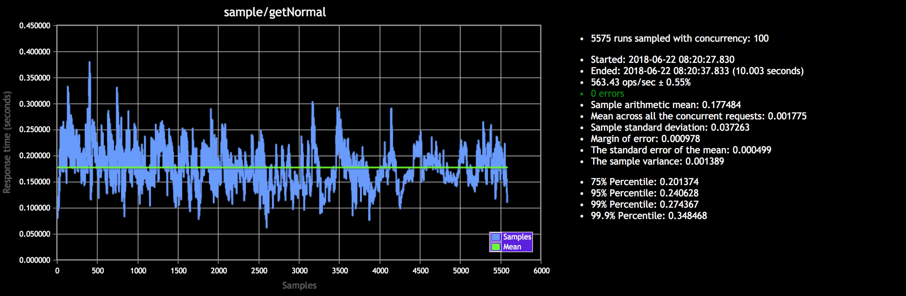
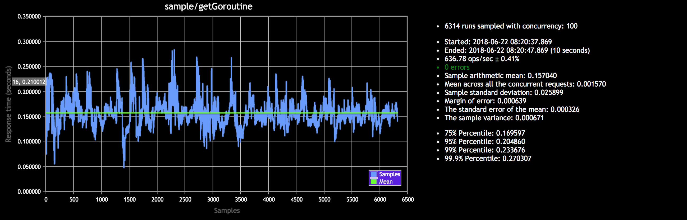
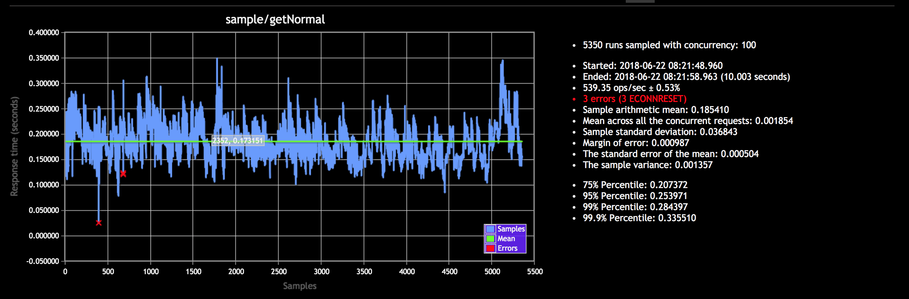
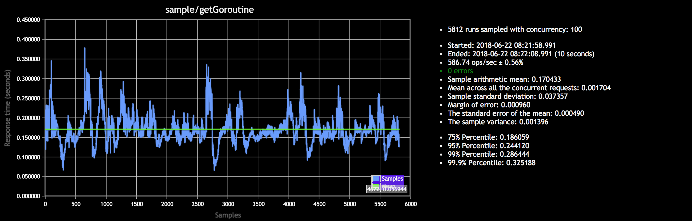

# c1x problem statement

**Prerequsites: Docker** 

I have created two API end points

http://localhost/v1/normal (This api block the main go routine for 30ms)

http://localhost/v1/goroutine (This api will call another goroutine in which we are doing another job which takes 30ms, so it is not blocking the main thread.)

# Two Approaces are taken in consideration
* Using HAPROXY server to distribute all calss between 2 containers
* API calls Direct on container.

## Using HAPROXY Server

### To test this out. Follow following steps.
* git clone this repository
* get into `c1x` directory
* docker-compose up
* Test (http://localhost/v1/normal & http://localhost/v1/goroutine)

#### Benchamarked API's using `https://github.com/matteofigus/api-benchmark` Results are below.

##### Normal API 

##### Goroutine API

## API calls to Direct Container

### To test this out. Follow following steps.
* git clone this repository
* get into `c1x` directory
* docker build . -t c1x
* docker run -p 80:8080 c1x
* Test (http://localhost/v1/normal & http://localhost/v1/goroutine)

#### Benchamarked API's using `https://github.com/matteofigus/api-benchmark` Results are below.

##### Normal API

##### Goroutine API

## By Results it seems that HAPROXY serves better also it was using less CPU due to http requests were getting served through 2 containers.